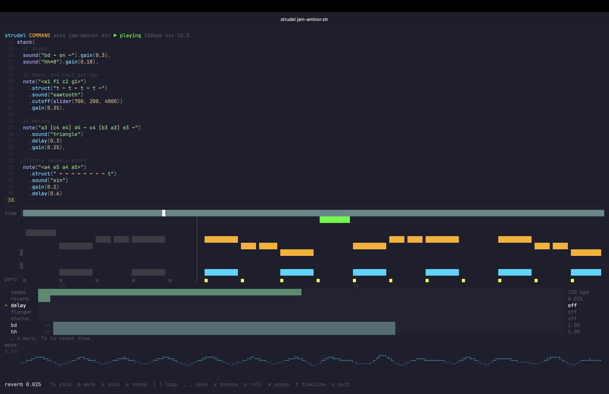

# strudel-term

[Strudel](https://strudel.cc) live coding in the terminal. Editor, piano roll,
oscilloscope and mixer in one pane. No browser: the pattern engine, the synth
engine and audio output all run in Node.



## Install

Needs macOS or Linux with working audio.

```
brew tap apolyaker92/tap
brew trust apolyaker92/tap
brew install strudel-term
```

Homebrew 6 refuses to load formulae from third-party taps until you trust them,
so the middle line is not optional: without it the install fails with "invalid
formula" and no obvious cause.

From source instead, which needs Node 22 or newer:

```
git clone https://github.com/apolyaker92/strudel-term
cd strudel-term
npm install
node src/cli.mjs jam.str
```

The file is created from a template if it does not exist. Edit it in place and
the sound follows as you type.

An alias is worth setting up, since the path is not something to type:

```
echo "alias strudel-term='node $PWD/src/cli.mjs'" >> ~/.zshrc
```

## What it does

Type and it plays. The buffer re-evaluates as you type, and only when it parses,
so a half-finished edit never reaches the file or the speakers.

`slider(0.5)` anywhere a number goes becomes a fader you can ride while the
pattern runs, and `b` writes the positions back into your code. Each argument of
a top-level `stack()` is a track with a mute, a solo and a level. Reverb, delay,
flanger and chorus ride alongside them.

`ctrl-e` opens note mode, where the arrow keys move pitches and the change is
written into your mini-notation, brackets and chords included.

`x` bounces to a wav in a separate process, so rendering never interrupts what
you are listening to.

Samples come from dirt-samples and are cached to disk, so a second run needs no
network.

**[The guide](GUIDE.md) covers all of it**, with every key and flag.

## Learning Strudel

`examples/course/` is six runnable files that build from a single cycle to a
full pattern. Start at `01-cycles.str` and read the comments.

## Testing

```
npm test
```

Unit tests for the editor, completion, sliders, key parsing and the effect bus,
then a smoke test that evaluates a pattern, renders it offline through
superdough, asserts the buffer is not silent, and prints the piano roll and
scope as text. No speakers or TTY required, so it runs over ssh and in CI.

## Notes

[NOTES.md](NOTES.md) covers the parts that needed working out: the forced
garbage collection, the rebuilt `arp`, the dependency patch, and what does and
does not work in this environment.

## Licence

AGPL-3.0-or-later, inherited from strudel and superdough. See
[COPYING.md](COPYING.md).
